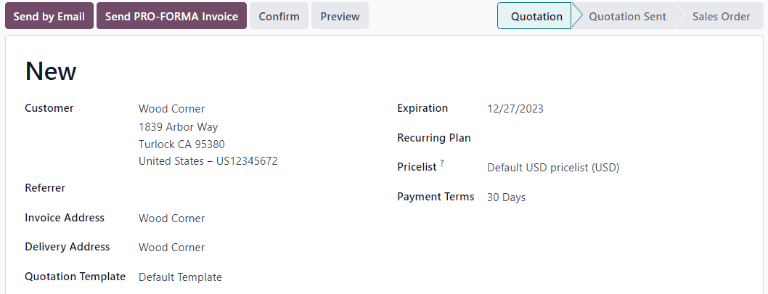

===============
Send quotations
===============

Once a qualified lead has been converted into an opportunity, the next step is to create and deliver
a quotation. This process can be easily handled through Odoo's *CRM* application.

Create a new quotation
======================

To create a new quotation, navigate to :menuselection:`Dashboard --> CRM --> Pipeline` and click on
any opportunity to open it. Review the existing information and update any fields, if necessary.

At the top of the form, click the :guilabel:`New Quotation` button.

.. image:: send_quotes/send-quotes-new-button.png
   :align: center
   :alt: Qualified lead form with New Quotation button emphasized.

.. note::
   The :guilabel:`Customer` field is not required on the :guilabel:`Opportunity` form. However,
   customer information must be added or linked before a quotation can be sent. If the
   :guilabel:`Customer` field is left blank on the :guilabel:`Opportunity`, clicking the
   :guilabel:`New Quotation` button opens a pop-up with the following options\ :

   - :guilabel:`Create a new customer`: creates a new customer record, using any available
     information provided on the :guilabel:`Opportunity`. For example, if an email address is
     provided, Odoo will use that information to determine a customer name, if possible.
   - :guilabel:`Link to an existing customer`: opens a drop-down field with existing customer names.
     Select a name to link this new quotation to the existing customer record.
   - :guilabel:`Do not link to a customer`: no changes made to the customer information.

Once this button is clicked, a :guilabel:`New Quotation` form appears. Confirm the information in
the top of the form, and update any missing or incorrect fields:

- :guilabel:`Customer`: the company or contact this quotation was created for.
- :guilabel:`Referrer`: if this customer was referred by another customer or contact, select it from
  the drop-down menu.
- :guilabel:`Invoice Address`: physical address where the invoice should be sent.
- :guilabel:`Delivery Address`: physical address where any products should be delivered.
- :guilabel:`Quotation Template`: if applicable, select a pre-configured quotation template.
- :guilabel:`Expiration`: date when this quotation is no longer valid.
- :guilabel:`Quotation Date`: creation date of draft/sent orders, confirmation date of confirmed
  orders.
- :guilabel:`Recurring Plan`: if this quotation is for a recurring product or subscription, select
  the recurring plan configuration to be used.
- :guilabel:`Pricelist`: select a pricelist to be applied to this order.
- :guilabel:`Payment Terms`: select any applicable payment terms for this quotation.

.. tip::
   The :guilabel:`Expiration` field automatically populates based on the creation date of the
   quotation, and the default validity time frame.

   To update the default validity time frame, navigate to :menuselection:`Sales app -->
   Configuration --> Settings --> Quotations & Orders` and update the :guilabel:`Default Quotation
   Validity` field. To disable automatic expiration, enter `0` in this field.

   When using a quotation template, the expiration date is based off of the :guilabel:`Quotation
   Validity` field on the template. To alter the validity date computation, go to
   :menuselection:`Sales app --> Configuration --> Sales Orders --> Quotation Templates`. Click
   on a template to open it, and update the number in the :guilabel:`Quotation Validity` field.

Order lines
-----------

After updating the customer, payment, and deadline information on the new quotation, the
:guilabel:`Order Lines` can be updated with the appropriate product information.

On the :guilabel:`Order Lines` tab, click :guilabel:`Add a product`. Type the name of an item into
the :guilabel:`Product` field to search through the product catalog. Select a product from the
drop-down menu, or create a new one by selecting :guilabel:`Create` or :guilabel:`Create and Edit`.

After selecting a product, update the :guilabel:`Quantity` if necessary. Confirm the information in
the remaining fields. To remove the line from the quotation, click the :guilabel:`🗑️ (trash can)`
icon.

Repeat the steps above until the quotation is complete.

Preview
-------

To see a preview of the quotation as the customer will see it, click :guilabel:`Preview`. Doing so
opens a preview in the :guilabel:`Customer Portal`. This is what the customer will see once the
quotation is delivered to them.

After reviewing the customer preview, click :guilabel:`Return to edit mode`.

Send by email
-------------

When the quotation is ready to deliver to the customer, click :guilabel:`Send by Email`. This opens
a pop-up window with a pre-configured email message. Information from the quotation, including the
contact information, total cost, and quotation title will be imported from the quotation. A pdf of
the quotation is added as an attachment to the email.

.. note::
   A pre-loaded template is used to create the email message. To alter the template, click the
   internal link to the right of the :guilabel:`Load template` field. To select a new template,
   select an option from the :guilabel:`Load template` drop-down.

Make any necessary changes to the email, then click :guilabel:`Send`. A copy of the message is added
to the *Chatter* of the of the record.

.. seealso::
   - `Quotation templates </applications/sales/sales/send_quotations/quote_template/>`_
   - `Optional products </applications/sales/sales/send_quotations/optional_products/>`_
   - `Quotation deadlines </applications/sales/sales/send_quotations/deadline/>`_

Mark an opportunity won or lost
===============================

In order to keep the pipeline up to date and accurate, opportunities need to be identified as won
or lost once a customer has responded to a quotation.

From the quotation form, return to the opportunity using the breadcrumbs at the top left of the
record. Or navigate to :menuselection:`CRM app --> Sales --> My Pipeline` and click on the correct
opportunity to open it.

At the top left of the form, click on either :guilabel:`Won` or :guilabel:`Lost`.

If the opportunity it marked *Won*, a green *Won* banner is added to the record, and it is moved to
the :guilabel:`Won` stage.

Marking an opportunity as *Lost*, opens the :guilabel:`Lost Reason`. From the drop-down, choose an
existing lost reason. If no applicable reason is available, create a new one by entering it into the
Lost Reason field, and clicking Create. Additional notes and comments can be added below the lost
reason designated in the Lost Reason field.

When all the desired information has been entered in the Lost Reason pop-up window, click Submit.

Upon clicking Submit, the pop-up window disappears, and Odoo returns to the lead detail form, where
a new red Lost banner is now present in the upper-right corner of the lead.

Once an opportunity is marked as *lost*, it is no longer considered active and is removed from the
pipeline. In order to view a *lost* lead from the pipeline, select either :guilabel:`Lost` or
:guilabel:`Archived` from the :guilabel:`Search bar`.`

.. important::
   While opportunities that have been marked as *lost* are considered *archived*, be advised that in
   order for an opportunity to be included as *lost* in reporting, it **must** be specifically
   marked as *lost*, not *archived*.

.. seealso::
   - `Manage lost opportunities </applications/sales/crm/pipeline/lost_opportunities>`_
