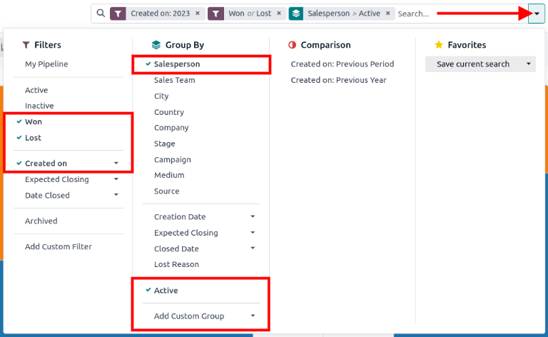
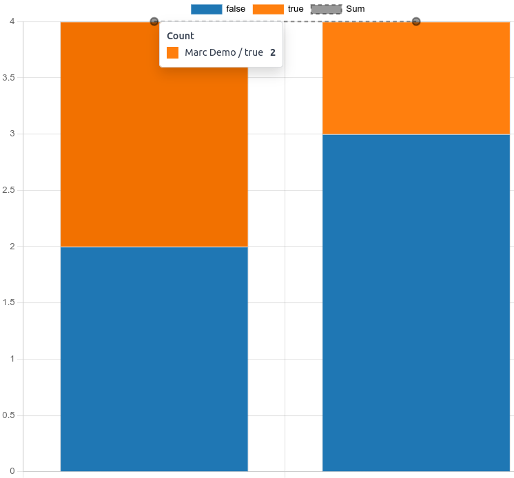
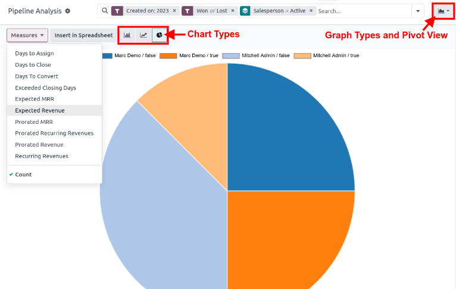
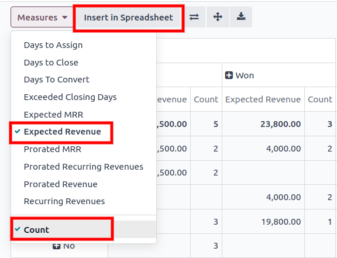
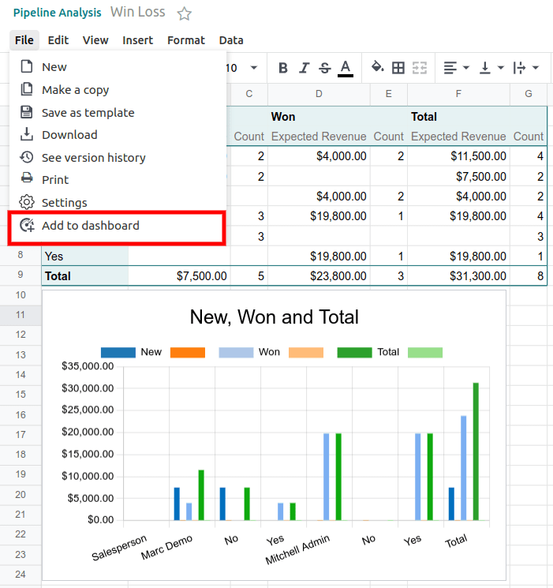
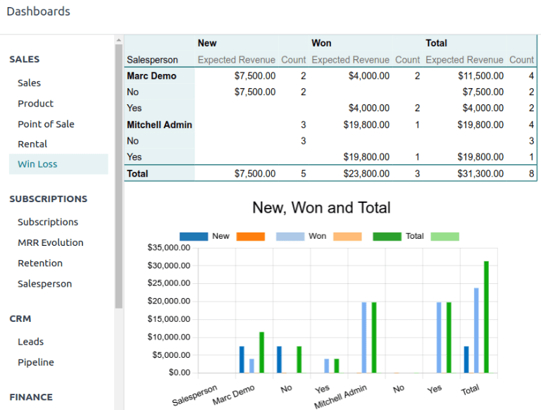

========================
Create a win/loss report
========================

A win/loss ratio is a metric that reflects the number of leads or opportunities won and lost by a
salesperson, sales team, or company. In the *CRM* app, win/loss ratios are available by creating a
win/loss report.

To create this report, navigate to :menuselection:`CRM app --> Reporting --> Pipeline`.

.. image:: win_loss/reporting-tab-and-pipeline-view.png
   :align: center
   :alt: View of CRM page showing the Reporting tab with the Pipeline view highlighted.

The :guilabel:`Pipeline Analysis` can be customized with various filters and group by options.
Click the drop-down menu in the :guilabel:`Search...` bar, and consider the following common
selections:

#. Filters: :guilabel:`Won`.
#. Filters: :guilabel:`Lost`.

   - Optional: Remove or adjust the :guilabel:`Created On` filter to reflect the last 30 days, the
     last quarter. By default, it reflects the entire year.

   - Optional: Show only leads that have reached the last stage of the sales pipeline (*Closed*) by
     adding a custom filter for :menuselection:`Last Stage Update is >= DATE`.
#. Group By: :guilabel:`Salesperson`.
#. Group By: :menuselection:`Add Custom Group --> Active`.

   - Optional: Group by :guilabel:`Sales Team` or :guilabel:`Company` instead of by
     :guilabel:`Salesperson`.

After making the above selections, the :guilabel:`Search Panel` should read:
:guilabel:`Created On:YYYY`, :guilabel:`Won or Lost`, :guilabel:`Salesperson > Active`. If so, the
graph now displays the :guilabel:`Count` of wins and losses for each salesperson. Hover over the
chart to see the percentage of wins (true) or losses (false). Click on a section of the chart to
open a list of those accounts.

Additional measurements and views
=================================

By default, the win/loss report measures the total :guilabel:`Count` of leads as a Bar Chart, but
there are many options for measures and views.

Go to :menuselection:`CRM app --> Reporting --> Pipeline`. Select any desired filters and group by
options for the report, and click the :guilabel:`Measures` button to select other measurement
options such as :guilabel:`Expected Revenue`.

Click the :guilabel:`Chart Icons` along the top to switch the graph from a :guilabel:`Bar Chart` to
a :guilabel:`Line Chart` or :guilabel:`Pie Chart`.

Additionally, clicking on the :guilabel:`View Icons` to the right of the search bar switches the
view of the report from a :guilabel:`Graph` view to a :guilabel:`Pivot` view, :guilabel:`Cohort`
view :guilabel:`List` view.

.. seealso::
   - :ref:`Reporting: Selecting a view <reporting/views>`

Add a win/loss report to dashboards
===================================

After configuring the views and measurements, a win/loss report can be saved to a spreadsheet and/or
dashboard for easier viewing in the future.

Go to :menuselection:`CRM app --> Reporting --> Pipeline`. Select any desired filters and group by
options for the report. Now, click on the :guilabel:`Pivot` view button to the right of the Search
bar.

At the Pivot view, click the :guilabel:`Measures` button and make sure the :guilabel:`Count` option
in the resulting drop-down is checked. Finally, click the :guilabel:`Insert in Spreadsheet` button.

In the pop-up menu, select :guilabel:`Blank Spreadsheet` and click the :guilabel:`Confirm` button. A
new spreadsheet will open with the win/loss pivot table already populated. Name the spreadsheet, and
add additional charts or formulas as desired.

Once complete, open the :guilabel:`File` menu and select :guilabel:`Add to dashboard`. Name the
dashboard, select a dashboard section, add access groups, and click the :guilabel:`Create` button.

The win/loss report is now viewable in the *Dashboards* app. This view automatically updates to
reflect the live data in the corresponding spreadsheet.

